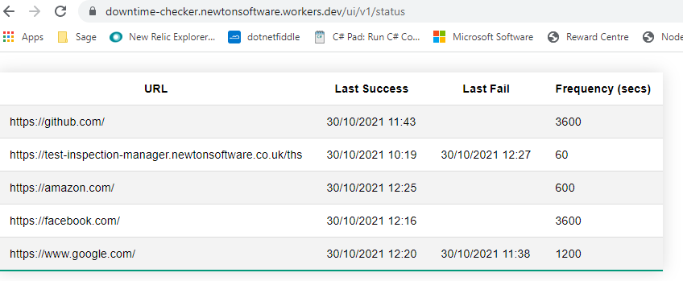

# Cloudflare Workers -- Downtime Checker

This is a proof of concept project to test the viability of running monitoring checks on websites to ensure they are available. A cloudflare worker is scheduled to run on a cron job every minute. When this runs it does the following :-

  1. Loads all the monitors from the KV store. 
  2. Checks each monitor to see if the elapsed frequency has passed since the previous attempt
  3. If the frequency has passed a fetch() is done against the URL
  4. The result of the fetch (200 == success anything else is a fail) is written to the status object.
  5. For fails, notifications are sent to the user via the email address provided.
  6. If the monitor recovers subsequently a recovery notifcation is sent to the email address.

A basic UI is provided allows the following :-

  1. A home page provides links to the other pages (https://downtime-checker.newtonsoftware.workers.dev/)
  2. A status page displays the current status of all the monitors in a tabulated format 
  3. A page allows new monitors to be added 
  4. A page lists all the current monitors configured.
  5. Execute Manual Check allows the 

## Getting Started
Navigate to the homepage :- https://downtime-checker.newtonsoftware.workers.dev/

You can check the existing status of monitors by navigating to the status screen :-

Adding a new monitor can be done via the "Add New Monitor" link on the home page. 
"List monitors" (from the home page) will show a JSON list of the all monitor names. This may include URLS not seen on the status page that have yet to be tested because the cron job has yet to pickup the newly created monitor. 

### TODO
1. Allow the editting and removing of monitors from the User Interface.
2. Make into a Single Page Application. Add Login functionality to allow users to store / modiy their own monitors. This may require further ammendments to how the data is stored in KV, as the applications scales a different storage model will be required. This might be implemented using Durable Objects or a back end database. This application will be expanded to include the following :-
    - allow users to specify the REST METHOD called (currently on GET is allowed)
    - allow user to specify the expected http response status (currently only 200 is considered successful)
    - allow web hooks to be called based on the response of the client.
